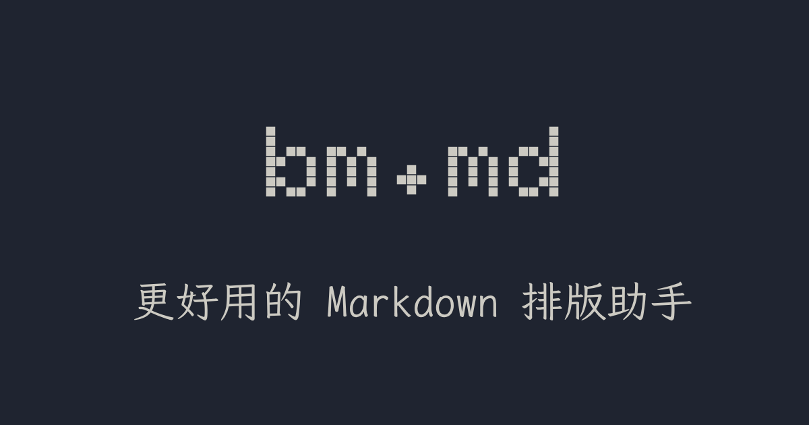
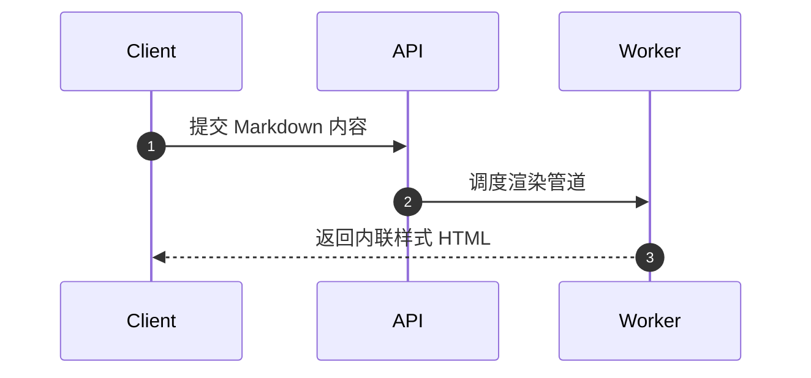

# 功能特性

bm.md 是一款面向内容创作者与开发者的 Markdown 排版工具，专为微信公众号、网页文章排版及文档分发设计。本文档系统介绍各模块的功能特性与使用方式。

---

## 多文件与文档管理

### 标签页管理

顶部标签栏支持多文档并行处理：

- **标签切换与浏览**：标签栏展示当前所有打开的文档，点击即可切换；标签过多时支持横向滚动。
- **新建文档**：点击标签栏右侧的 `+` 按钮，立即创建并激活空白文档。
- **关闭文档**：点击标签右侧的 `×`，或在聚焦标签时按下 `Delete` 键关闭对应文档。
- **重命名文档**：双击标签标题或聚焦时按下 `F2` 即可原地修改文件名。
- **智能自动命名**：新建文档未命名时，系统将依据正文首个一级标题（H1）自动更新文件名。

### 事务化本地存储

- **IndexedDB 存储模型**：文档列表元数据（catalog）与文档正文独立存储于 IndexedDB（`bm.md` v2）。文件创建、重命名、删除操作在单一事务中完成，确保元数据与正文一致性，页面刷新数据不丢失。
- **多标签页会话隔离**：活动文件标识保存于 `sessionStorage`，同一浏览器打开多个标签页时各自保持独立的编辑状态，互不干扰。
- **跨标签同步**：某一标签页更新或保存文件时，仅向 `localStorage` 发送轻量版本失效信号（`bm.md.files.signal`），其他标签页据此增量重读 IndexedDB，避免在存储中传递全量数据快照。
- **写入合并与降级保护**：连续按键输入以 150ms 尾随窗口合并写入，切换标签或窗口失焦时立即刷新。若浏览器 IndexedDB 无法访问，系统自动降级为内存存储，并保留可随时导出的本地草稿。

---

## 内容导入与编辑

### 多格式文档导入

支持通过拖拽、系统文件选择（快捷键 `Cmd/Ctrl + O`）或剪贴板粘贴导入外部内容：

- **原生 Markdown 文档**：支持 `.md`、`.markdown`、`.mdown`、`.mkd` 等扩展名（大小写不敏感），直接载入编辑器。
- **HTML 内容转换**：导入 `.html`、`.htm` 文件或从网页复制富文本粘贴到编辑器时，由后台 Worker 自动解析并逆向转换为纯净 Markdown。
- **多类型文档转换**：内置 AnyDoc WASM 转换引擎，可在浏览器端将以下格式解析转换为 Markdown：
  - Word 文档：`.doc`、`.docx`、`.docm`
  - PowerPoint 演示文稿：`.ppt`、`.pps`、`.pot`、`.pptx`、`.pptm`、`.ppsx`、`.ppsm`
  - Excel 工作簿：`.xls`、`.xlsx`、`.xlsm`、`.xlsb`
  - OpenDocument 格式：`.odt`、`.ods`、`.odp`
  - 电子书与纯文本：`.rtf`、`.epub`、`.csv`、`.pdf`
- **导入规格限制**：单个待转换文档体积上限为 20MB，超限文档会在进入转换引擎前直接提示并拦截。

### 编辑器体验

基于 CodeMirror 6 构建的高性能纯文本编辑环境：

- **语法着色**：针对 Markdown 语法与代码块提供实时着色。
- **Ayu 配色体系**：编辑器深浅色面严格对齐整站视觉标准，避免高对比刺眼或低对比阅读疲劳。
- **自动格式化**：集成 markdownlint 规则引擎，一键统一标题层级、规范列表缩进、整理空行与清除行尾空白字符（快捷键 `Cmd/Ctrl + Shift + L`）。
- **Markdown 本地导出**：随时将当前正文直接保存为本地 `.md` 文件（快捷键 `Cmd/Ctrl + S`）。

---

## 排版渲染与预览

### 实时预览引擎

- **增量 DOM 渲染**：利用 morphdom 实现精准的 DOM 差异比对，仅替换发生变动的节点，杜绝全量刷新引起的滚动抖动。
- **渲染防抖**：采用 100ms 输入防抖，兼顾实时输入流畅感与性能开销。
- **iframe 严格沙箱**：预览区运行于独立的 iframe 沙箱中，外部 UI 样式与正文排版 CSS 完全隔离。
- **双向滚动同步**：编辑器与预览视窗保持位置联动，滚动任一侧均能精准对应阅读位置；该行为可在设置中随时关闭。
- **软换行控制（Breaks）**：系统遵循标准 Markdown 规范，默认段落内单个回车视为软换行（不产生 HTML 换行）。在编辑器设置中开启“回车即换行”后，单个回车将自动转为 `<br>` 换行输出。

### 设备模拟预览

预览区提供两类经过真实设备比例校准的模拟容器：

- **移动端视图**：模拟 iPhone 设备视窗，外壳设计宽度 415px（内容视口 375px，左右边框各 20px），配备灵动岛装饰，高度在 650px 至 850px 间自适应，适合模拟微信阅读效果。
- **桌面端视图**：模拟 Safari 浏览器视窗，最大宽度 768px，配备简约标题栏与中性窗口控制点。
- **视窗自适应**：拖拽中央分割线仅调整两侧工作区占比，不中断预览渲染状态或修改当前选定的设备模拟模式。

---

## 主题与样式系统

### Markdown 排版样式

内置 16 款经过专门适配的 Markdown 排版样式。默认样式为「Kami」，源自 [tw93/Kami](https://github.com/tw93/Kami)，追求克制、通透的纸张阅读美感。点击工具栏“浏览全部样式…”可唤起画廊弹窗，平铺查看所有样式的真实渲染缩略图并一键应用。

| 样式 ID         | 显示名称      | 风格定位                           |
| :-------------- | :------------ | :--------------------------------- |
| `kami`          | Kami          | 经典纸张阅读质感（默认排版）       |
| `bauhaus`       | Bauhaus       | 包豪斯功能主义，几何块面与理性构图 |
| `blueprint`     | Blueprint     | 蓝图工程图纸，冷峻的技术文档气质   |
| `botanical`     | Botanical     | 植物园自然调性，柔和温润的自然色泽 |
| `newsprint`     | Newsprint     | 现代报章排版，清晰紧凑的铅印质感   |
| `retro`         | Retro         | 复古怀旧胶片，温和的复古印刷风     |
| `sketch`        | Sketch        | 手绘素描风，带手作感的草稿笔触     |
| `terminal`      | Terminal      | 终端绿字，硬核命令行极简感         |
| `forest-review` | Forest Review | 森林季报，暖色系人文编辑刊物       |
| `navy-vellum`   | Navy Vellum   | 深蓝羊皮纸，静谧典雅的学术笔记     |
| `rose-nocturne` | Rose Nocturne | 玫瑰夜曲，暗调时尚刊物与艺术文论   |
| `solar-catalog` | Solar Catalog | 日光图录，充满张力的展览海报风格   |
| `triad-paper`   | Triad Paper   | 三调纸面，现代杂志色彩碰撞         |
| `field-tablet`  | Field Tablet  | 田野铭牌，考据与野外调查手册质感   |
| `public-square` | Public Square | 公共广场，利落明确的行动主义海报   |
| `pixel-orbit`   | Pixel Orbit   | 像素轨道，复古像素街机风格         |

### 代码块高亮主题

内置 14 款精选 highlight.js 代码配色方案，满足不同明暗环境下的高对比度阅读需求：

- **深色主题**：Catppuccin Frappé、Catppuccin Macchiato、Catppuccin Mocha、Tokyo Night Dark、Panda Syntax Dark、Rosé Pine、Kimbie Dark、Paraiso Dark。
- **浅色主题**：Catppuccin Latte、Tokyo Night Light、Panda Syntax Light、Rosé Pine Dawn、Kimbie Light、Paraiso Light。

### 自定义 CSS 扩展

支持在内置排版样式的基础之上追加自定义 CSS：

- **作用域约束**：自定义选择器必须限定在容器 `#bm-md` 命名空间下（例如 `#bm-md h1 { color: #d97706; }`）。
- **层叠顺序**：自定义样式注入于排版主题之后，可精确覆盖已有样式。
- **本地持久化**：修改后点击“保存”即刻写入本地配置，刷新页面保持生效。

---

## 平台导出与富文本复制

### 一键复制富文本

通过 `juice` 将排版 CSS 精准内联到 HTML 标签中，确保粘贴后格式不丢失：

- **微信公众号复制**（快捷键 `Cmd/Ctrl + Shift + 7`）：
  - 自动将正文超链接转为文末引用脚注列表。
  - 针对代码块空格注入 `\u00A0`，规避微信后台对连续空格的吞并问题。
  - 宽表格自动包装横向滚动容器，防止移动端阅读时撑破版面。
- **通用 HTML 复制**（快捷键 `Cmd/Ctrl + Shift + 0`）：保留完备的内联样式结构，适用于语雀、飞书、知乎等现代富文本发布系统。

### 长图与画板导出

- 基于 snapDOM 捕获当前设备框中已渲染的预览内容。
- 支持一键导出 JPEG 文件下载，或将带有透明通道的 PNG 图像直接写入剪贴板。

### 矢量 PDF 导出与打印

- **本地 WASM 排版引擎**：集成 Takumi PDF 引擎，直接在浏览器端解析当前页面的 HTML/CSS 并按 A4 标准分页，输出矢量 PDF。
- **矢量文本与大纲书签**：生成的 PDF 保留真实文字（可选择、复制与检索），并根据各级标题自动构建层级书签目录。
- **动态字体子集化**：根据文档内容按需拉取 Google Fonts 的 Noto 系列中日韩与 Emoji 字体分片；未覆盖字符替换为 `□` 占位符号。
- **版面与页边距控制**：页面背景色统一延展至整页（含页边距），正文纹理限定于内容区域，遵循标准页边距（上下 45pt、左右 30pt）。
- **资源限制与容灾**：外链图片须允许跨域访问（CORS），单图限制 20MiB、总大小限制 64MiB；网络离线且未缓存字体、或 PDF 引擎异常时，系统自动无缝切换为浏览器原生打印对话框。

---

## 图片上传与图床存储

编辑器支持将本地图片上传至远端存储并自动插入 Markdown 语法：

- **上传方式**：支持拖拽图片进入编辑区，或直接从剪贴板粘贴截图。
- **安全与类型校验**：仅接受经真实文件签名校验的 PNG、JPEG、GIF 与 WebP 图片；单张文件限制 5MB，拒绝伪造扩展名或不受信任的 SVG 矢量文件。
- **多后端存储策略**：
  - **S3 兼容对象存储**：配置环境变量 `S3_ENDPOINT`、`S3_ACCESS_KEY_ID`、`S3_SECRET_ACCESS_KEY` 后自动启用，支持 Cloudflare R2、MinIO、AWS S3 等。
  - **DC 图床回退**：未配置 S3 或配置缺失时，自动回退到配置的 DC 图床服务。

---

## 开发者与生态集成

基于 `src/lib/markdown/definitions.ts` 集中注册的唯一 Tool Registry，bm.md 的核心 Markdown 能力以三类规范形式向外输出：

### 1. 命令行界面（CLI）

命令行工具 `bmmd` 支持文件参数与 stdin 管道输入，默认输出至 stdout：

```bash
# 渲染为适合微信公众号的内联 HTML
bmmd render input.md --platform wechat --output output.html

# 开启软换行转换并追加外部样式文件
bmmd render input.md --breaks --custom-css-file extra.css > output.html

# 将 HTML 文件逆向转换为 Markdown
bmmd parse input.html --output output.md

# 提取 Markdown 文档中的纯文本内容
bmmd extract input.md

# 按照规则校验并原地修复 Markdown 文件
bmmd lint input.md --fix
```

核心命令选项参考：

| 选项旗标                     | 适用命令 | 默认值         | 功能说明                                           |
| :--------------------------- | :------- | :------------- | :------------------------------------------------- |
| `-o, --output <file>`        | 全部     | stdout         | 指定输出文件路径                                   |
| `--platform <platform>`      | `render` | `html`         | 目标平台，可选 `html` 或 `wechat`                  |
| `--markdown-style <id>`      | `render` | `kami`         | 指定 16 款排版样式 ID 之一                         |
| `--code-theme <id>`          | `render` | `kimbie-light` | 指定 14 款代码高亮主题 ID 之一                     |
| `--mermaid-theme <id>`       | `render` | 空（默认）     | 指定 Mermaid 图表配色主题                          |
| `--infographic-theme <id>`   | `render` | `default`      | 信息图主题（`default`, `dark`, `hand-drawn`）      |
| `--infographic-palette <id>` | `render` | `antv`         | 信息图调色板（`antv`, `spectral`）                 |
| `--custom-css <css>`         | `render` | 空             | 传入内联自定义 CSS 字符串                          |
| `--custom-css-file <file>`   | `render` | -              | 读取指定文件内容作为自定义 CSS                     |
| `--breaks`                   | `render` | 关闭           | 将段落内软换行转换为 HTML `<br>`                   |
| `--no-footnote-links`        | `render` | 开启           | 禁止自动将文中超链接转换为文末脚注                 |
| `--no-open-links`            | `render` | 开启           | 禁止为外部链接附加 `target="_blank"`               |
| `--fix`                      | `lint`   | 关闭           | 将规范修复结果直接写回原文件（与 `--output` 互斥） |

### 2. REST API

通过 oRPC 与 OpenAPI 生成规范接口，前端提供 Scalar 文档页面（`/docs`）：

- `POST /api/markdown/render`：Markdown 转内联 HTML。
- `POST /api/markdown/parse`：HTML 逆向转 Markdown。
- `POST /api/markdown/extract`：提取 Markdown 纯文本。
- `POST /api/markdown/lint`：Markdown 规则校验与自动修复。
- `POST /api/upload/image`：独立图片上传接口（`multipart/form-data`）。

### 3. Model Context Protocol（MCP）

提供标准化 MCP 端点（`/mcp`），AI Agent 可通过 Streamable HTTP 协议直接调度 `render`、`parse`、`extract`、`lint` 四项工具。在 Web 界面访问 `/docs/mcp` 可查看适用于 Claude Desktop、Cursor 等客户端的预制配置片段。

---

## 增强排版语法参考

除标准 CommonMark 规范外，bm.md 额外支持以下排版与扩展语法：

### 图片尺寸控制（Obsidian 语法）

在图片替代文本中使用竖线 `|` 声明宽度或宽高：`` 或 ``。单位固定为像素且不写单位，渲染时会从替代文本与题注中剥离尺寸后缀。




### 文本高亮

使用双等号 `==高亮文本==` 包裹需要强调的文字，高亮内部仍可嵌套粗体、斜体与删除线：

请务必在提交前确认 ==核心数据准确无误==。

这是 ==**必须执行的检查**==，这是 ==_需要留意的条件_==，废弃项可写为 ==~~旧参数~~==。

### YAML 与 TOML Frontmatter 自动表格化

文档顶部的元数据将自动解析并渲染为紧凑美观的属性表格，YAML 使用 `---` 包裹，TOML 使用 `+++` 包裹。

YAML 源文档：

```yaml
---
title: 版本发布通告
author: bm.md 团队
date: 2026-09-11
---
```

渲染后的属性表格：

| 属性     | 值           |
| :------- | :----------- |
| `title`  | 版本发布通告 |
| `author` | bm.md 团队   |
| `date`   | 2026-09-11   |

TOML 源文档：

```text
+++
title = "技术架构演进"
status = "draft"
+++
```

渲染后的属性表格：

| 属性     | 值           |
| :------- | :----------- |
| `title`  | 技术架构演进 |
| `status` | draft        |

### 流程图与图表（Mermaid）

将代码块语言标注为 `mermaid`，支持时序图、流程图、状态图、甘特图等，系统将其转换为经过安全清理的独立 SVG 矢量图像：



### 信息图（AntV Infographic）

将代码块语言标注为 `infographic`，通过声明式 DSL 语法快速生成结构化视觉信息卡片：

```infographic
infographic list-row-simple-horizontal-arrow
theme
  palette antv
data
  title 生产发布三步法
  lists
    - label 编写
      desc 梳理文字与图表逻辑
    - label 预览
      desc 切换移动端校验视觉效果
    - label 导出
      desc 一键复制至微信公众号
```

### 数学公式（KaTeX）

行内公式使用单美元符号，独立公式块使用双美元符号独占一段。行内示例：质能方程 $E = mc^2$ 在文档中随文字排版。

独立公式块：

$$
\int_{-\infty}^{+\infty} e^{-x^2} dx = \sqrt{\pi}
$$

### GitHub Alert 警示块

在引用块首行写入 `> [!NOTE]` 等标记即可渲染对应警示样式：

> [!NOTE]
> 提示信息：用于补充说明常规背景。

> [!TIP]
> 技巧建议：帮助提升操作效率的实用方法。

> [!IMPORTANT]
> 重要事项：用户必须知晓的关键规则。

> [!WARNING]
> 操作警告：执行前需复核的前置条件。

> [!CAUTION]
> 严重风险：可能引起数据覆写或不可逆后果。

---

## 交互控制与快捷键

### 全局命令面板

按下 `Cmd/Ctrl + K` 随时唤起命令面板，支持模糊搜索所有编辑器操作、平台导出、排版样式切换、代码主题选择及系统设置。

### 快捷键对照表

| 动作                | macOS 快捷键           | Windows / Linux 快捷键 |
| :------------------ | :--------------------- | :--------------------- |
| 打开文件            | `Cmd + O`              | `Ctrl + O`             |
| 导出 Markdown 文件  | `Cmd + S`              | `Ctrl + S`             |
| 自动格式化 Markdown | `Cmd + Shift + L`      | `Ctrl + Shift + L`     |
| 复制微信公众号格式  | `Cmd + Shift + 7`      | `Ctrl + Shift + 7`     |
| 复制通用 HTML 格式  | `Cmd + Shift + 0`      | `Ctrl + Shift + 0`     |
| 唤起命令面板        | `Cmd + K`              | `Ctrl + K`             |
| 重命名当前文件标签  | `F2`（或双击标签）     | `F2`（或双击标签）     |
| 关闭当前文件标签    | `Delete`（聚焦标签时） | `Delete`（聚焦标签时） |
