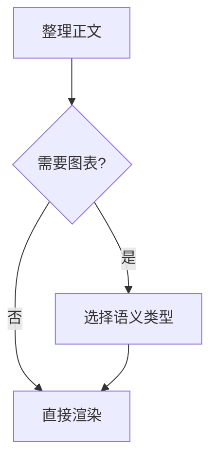
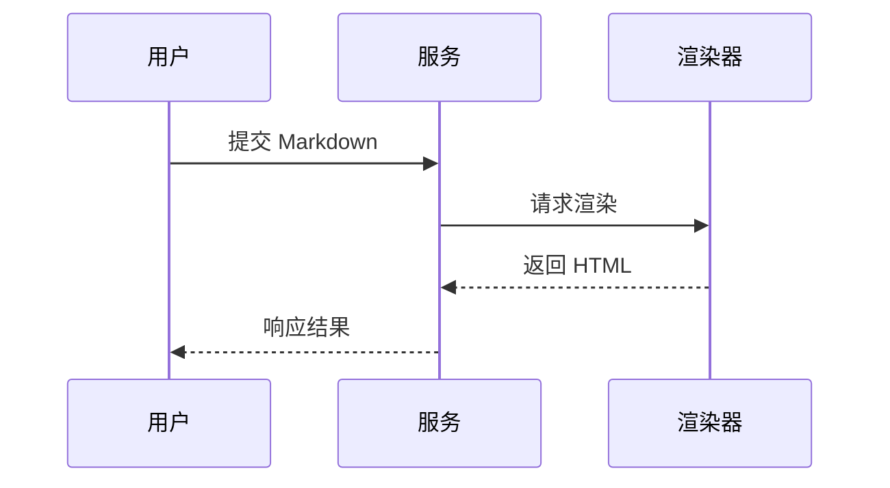
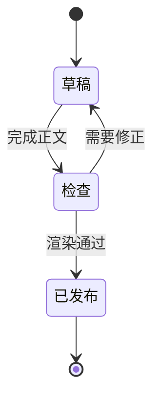
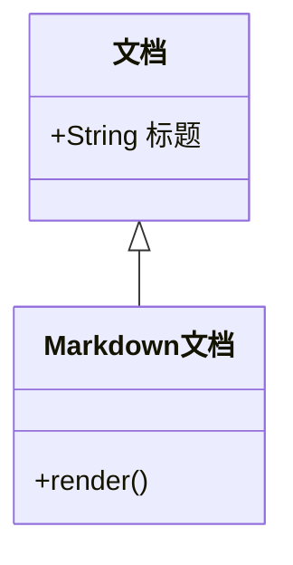
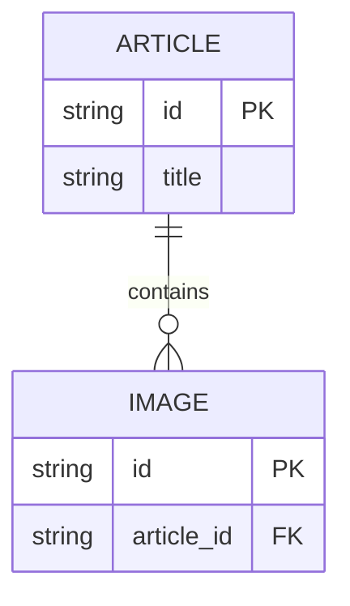

# Mermaid 图表

只在图形比正文更容易理解时使用 Mermaid。将合法语法放入语言为 `mermaid` 的围栏代码块，完成 Markdown 后交给 bm.md `render`。

## 选择图表

| 信息结构               | 图表类型          | 适用内容                     |
| ---------------------- | ----------------- | ---------------------------- |
| 流程、分支、调用链概览 | `flowchart`       | 操作流程、决策路径、依赖方向 |
| 按时间发生的交互       | `sequenceDiagram` | 服务调用、角色协作、请求响应 |
| 状态与状态迁移         | `stateDiagram-v2` | 生命周期、工作流状态         |
| 类、继承与成员         | `classDiagram`    | 领域模型、代码结构           |
| 实体、字段与基数       | `erDiagram`       | 数据模型、表关系             |

不要生成其他 Mermaid 类型。`xychart-beta` 当前不受 bm.md 支持；真实数值改用 Infographic 的 chart 模板或 Markdown 表格。

## 稳定示例

### 流程图

### 时序图

### 状态图

### 类图

### ER 图

## 可读性规则

- 一个图只表达一个主题，节点标签使用正文语言。
- 保持方向一致；流程较长时优先 `TD`，调用链较短时可用 `LR`。
- 节点使用短语，把解释留在图外正文中。
- 分支边写清条件；时序消息使用动作短语；ER 实体补齐实际字段，避免空实体。
- 只表达已知关系，不补造节点、调用、字段或基数。
- 主题通过 bm.md `render` 的 `mermaidTheme` 参数选择；使用项目提供的有效值，不自行杜撰主题 ID。

## 渲染失败处理

1. 检查围栏语言是否为 `mermaid`、首行图表类型是否在本文支持范围内、括号与关系符是否闭合。
2. 缩短标签并删除未经验证的指令，先渲染最小图，再逐步恢复节点和关系。
3. 检查 bm.md 输出是否出现图表错误且关键标签是否存在。
4. 仍失败时改成编号列表、表格或普通代码块，保留全部事实，不交付错误图。
